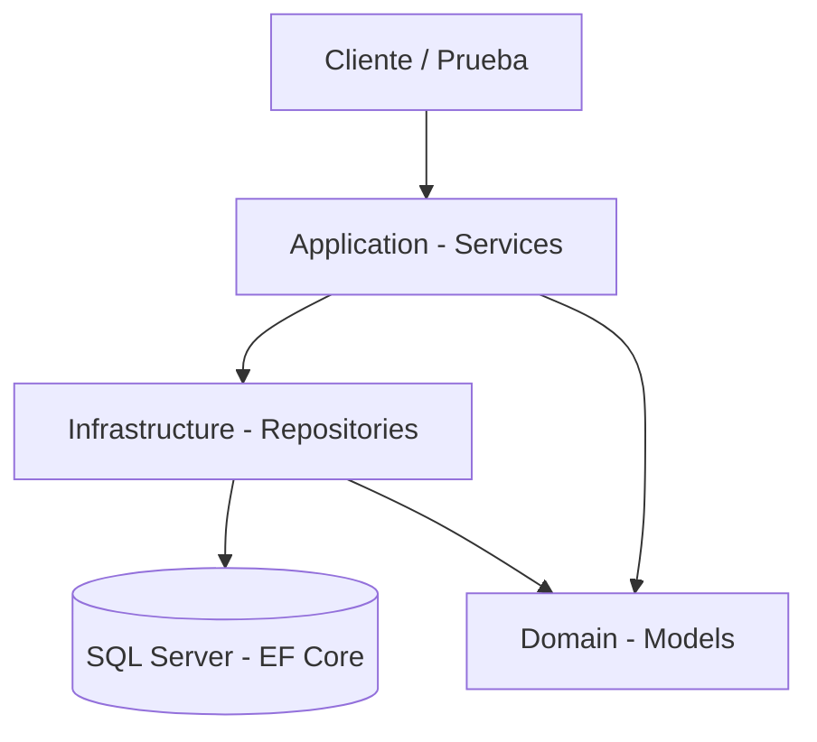

# ADR-01: Arquitectura en Capas con ASP.NET Core para TaskFlow

| Campo  | Valor |
|--------|-------|
| Autor  | Enrique Zavala |
| Fecha  | 01/06/2026 |
| Estado | `Reemplazado por ADR-02` |

---

## Contexto

TaskFlow es una aplicación de gestión de tareas personales dirigida a estudiantes universitarios. El objetivo es permitir registrar actividades diarias con sus tareas asociadas, asignarles prioridad y marcarlas como completadas.

El proyecto se desarrolla de forma individual, con tiempo limitado y usando tecnologías vistas en clase. Se requería una arquitectura que fuera comprensible, mantenible y que permitiera crecer hacia una API REST en fases posteriores.

---

## Decisión

Se adopta una **arquitectura en capas (Layered Architecture)** con los siguientes componentes:

- **Domain**: Modelos de entidad (, )
- **Infrastructure**: Repositorios y acceso a datos con Entity Framework Core
- **Application**: Servicios con la lógica de negocio
- **API**: Controladores REST (fase siguiente)

Stack tecnológico: **C# + ASP.NET Core 8 + Entity Framework Core + SQL Server**

### ¿Por qué?

La arquitectura en capas separa claramente las responsabilidades: el dominio no depende de la base de datos, y los servicios no conocen los detalles HTTP. Esto permite que en la siguiente fase se agregue una capa API sin modificar la lógica existente.

### Alternativas consideradas

| Alternativa | Por qué la descarté |
|-------------|---------------------|
| Arquitectura monolítica sin capas | Dificulta el mantenimiento y mezcla responsabilidades |
| Arquitectura hexagonal (Ports & Adapters) | Mayor complejidad para el alcance del proyecto |
| Minimal API sin capas | No escala bien cuando la lógica de negocio crece |

---

## Consecuencias

**✅ Lo que gano:**

- Separación clara de responsabilidades: cada capa tiene un rol definido
- Facilidad para agregar una capa API REST sin tocar el dominio ni los servicios

**⚠️ Lo que sacrifico o asumo:**

- Más archivos y proyectos desde el inicio (mayor setup)
- Si el proyecto no crece, la separación en capas puede ser overhead innecesario

## Diagrama

