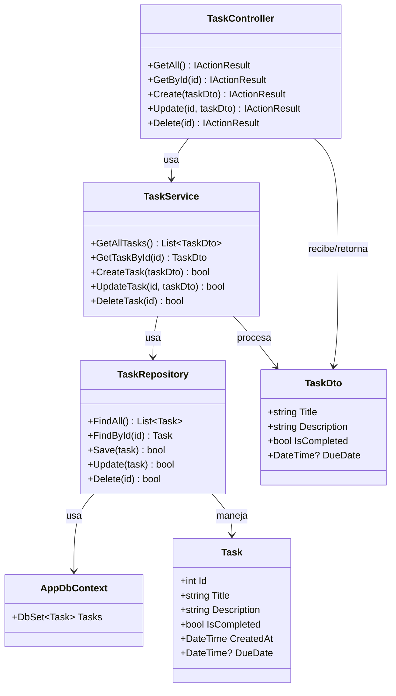
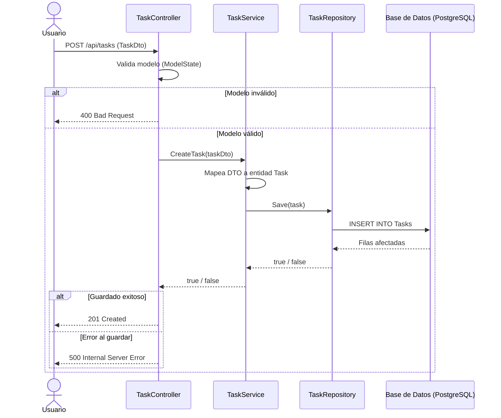
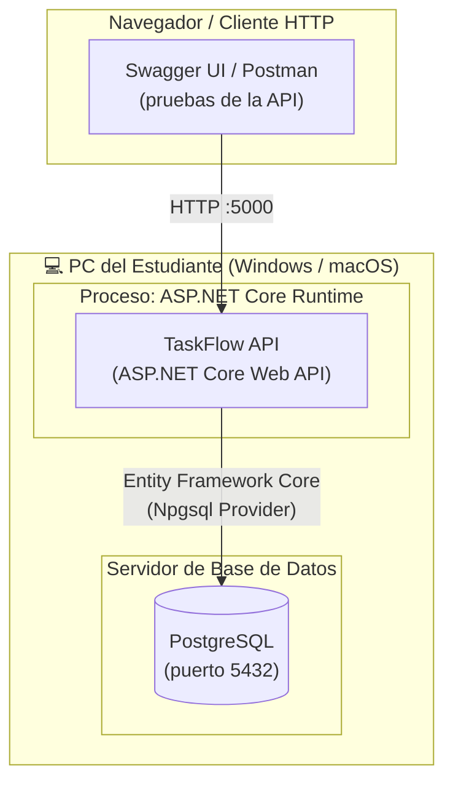
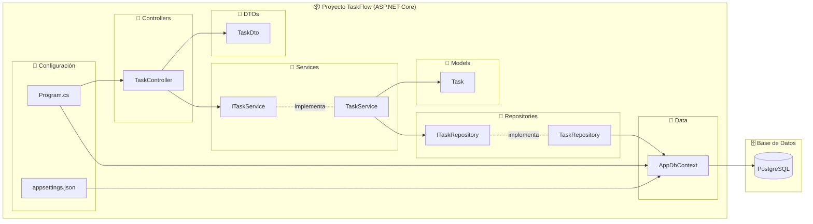

# ADR-02: Vistas Arquitectónicas del Sistema TaskFlow

| Campo   | Valor              |
|---------|--------------------|
| Autor   | Enrique Zavala     |
| Fecha   | 05/06/2026         |
| Estado  | Propuesto          |
| Basado en | ADR-01           |

---

## Contexto

Como parte del desarrollo de **TaskFlow**, una aplicación de gestión de tareas personales dirigida a estudiantes, se requiere documentar formalmente las vistas arquitectónicas del sistema. Esto permite comunicar la estructura y el comportamiento del sistema desde distintas perspectivas, facilitando su comprensión, mantenimiento y evolución futura.

Las vistas se aplican sobre la arquitectura en capas definida en ADR-01 (Controller → Service → Repository → Base de Datos), desarrollada con C# y ASP.NET Core.

---

## Decisión

Se documentan las **4 vistas arquitectónicas del modelo 4+1** aplicadas al proyecto TaskFlow:

1. **Vista Lógica** – Estructura interna de clases y capas.
2. **Vista de Procesos** – Flujo de ejecución en tiempo de ejecución.
3. **Vista de Despliegue** – Infraestructura física donde corre el sistema.
4. **Vista Física** – Distribución de componentes y módulos del sistema.

---

## ¿Por qué estas vistas?

- El modelo 4+1 es un estándar reconocido para documentar arquitecturas de software.
- Permiten entender el sistema desde distintos ángulos: desarrollador, operaciones y stakeholders.
- Los diagramas en Mermaid son compatibles con GitHub y no requieren herramientas externas.
- Complementan la arquitectura en capas ya definida en ADR-01.

---

## Vista 1: Vista Lógica

Muestra las principales clases, capas y sus relaciones dentro del sistema TaskFlow.

---

## Vista 2: Vista de Procesos

Muestra el flujo de ejecución cuando un usuario crea una nueva tarea en TaskFlow.

---

## Vista 3: Vista de Despliegue

Muestra cómo se despliega TaskFlow en el entorno de ejecución del estudiante (entorno local de desarrollo), con PostgreSQL como motor de base de datos.

---

## Vista 4: Vista Física (Componentes)

Muestra los módulos y componentes del sistema y cómo están organizados dentro del proyecto.

---

## Consecuencias

**Ventajas:**
- Las vistas documentan el sistema desde múltiples perspectivas, mejorando la comprensión.
- Los diagramas Mermaid se renderizan directamente en GitHub sin herramientas adicionales.
- Facilitan la incorporación de nuevos desarrolladores o revisores al proyecto.
- Sirven como base para futuras decisiones de arquitectura.

**Desventajas:**
- Requiere mantener los diagramas actualizados conforme evoluciona el código.
- La vista de despliegue es simple por tratarse de un entorno local de desarrollo.

---

## Alternativas consideradas

| Alternativa | Razón de descarte |
|---|---|
| UML con herramienta gráfica (Lucidchart, etc.) | No integra bien con el repositorio; requiere exportar imágenes |
| Draw.io en XML | Más complejo de versionar; Mermaid es más legible en texto plano |
| No documentar vistas | Incumple el objetivo de la práctica y dificulta el mantenimiento |

---

## Declaración de uso de IA

Para la elaboración de este ADR se utilizó inteligencia artificial (Claude de Anthropic) como apoyo en la redacción y generación de los diagramas Mermaid. La revisión, validación del contenido y decisiones arquitectónicas son responsabilidad del autor.

---

*ADR-02 — TaskFlow | Enrique Zavala | Junio 2026*
