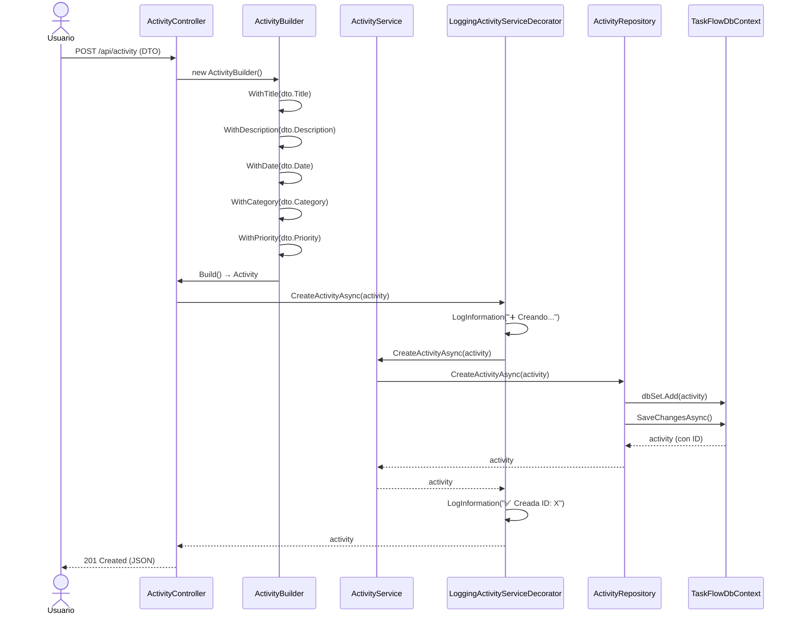
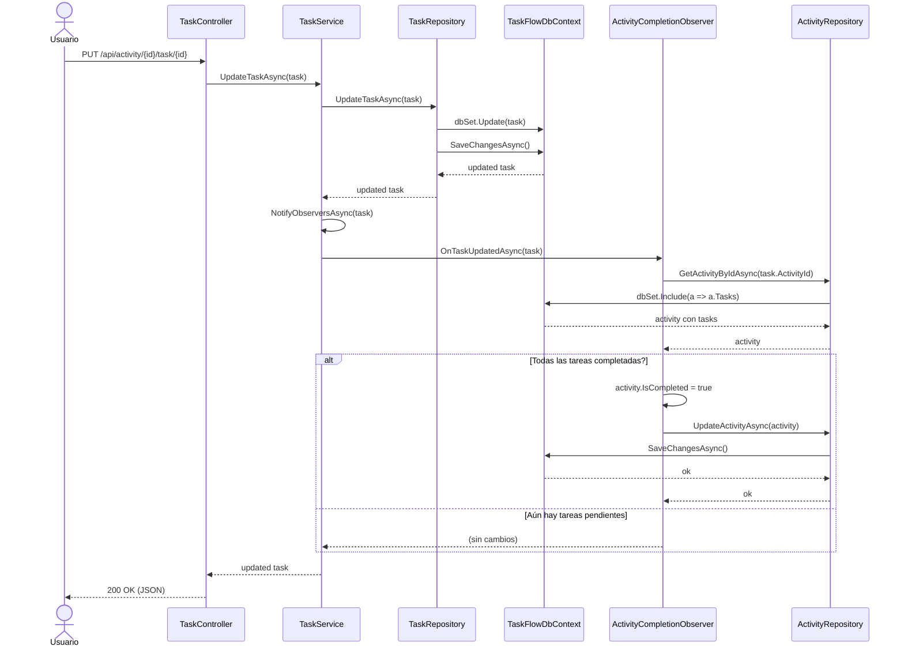

# ADR-03: Patrones Arquitectónicos y Patrones de Diseño GoF en TaskFlow

| Campo   | Valor                                              |
|---------|----------------------------------------------------| 
| Autor   | Enrique Zavala                                     |
| Fecha   | 25/06/2026                                         |
| Estado  | Aprobado                                           |
| Basado en | ADR-01, ADR-02                                    |
| Revisión | 1.0                                                |

---

## Contexto

Como parte de la evolución del proyecto **TaskFlow**, se implementaron **patrones de diseño GoF (Gang of Four)** en la arquitectura en capas definida en ADR-01 y ADR-02. El sistema ha crecido de una arquitectura simple a una arquitectura en **5 capas** con patrones avanzados que mejoran mantenibilidad, extensibilidad y testabilidad.

La necesidad de documentar estos patrones surge de la complejidad creciente del sistema y la importancia de que futuros desarrolladores entiendan las decisiones arquitectónicas tomadas.

---

## Decisión

Se documentan formalmente los siguientes aspectos de TaskFlow:

1. **Arquitectura en 5 Capas** – Separación clara de responsabilidades
2. **Patrones de Diseño GoF Implementados** – Builder, Observer, Decorator, Strategy
3. **Estructura de Proyectos C#** – Organización y dependencias
4. **Endpoints REST Completos** – Rutas anidadas, filtros especializados
5. **Pruebas Unitarias** – Testing de patrones y servicios
6. **Middleware y Manejo Global de Excepciones** – Resiliencia
7. **Seed Data y Migrations** – Consistencia de datos

---

## ¿Por qué estos patrones?

- **Builder**: Construcción fluida y segura de entidades complejas desde DTOs
- **Observer**: Notificación automática de cambios sin acoplamiento
- **Decorator**: Agregación de comportamiento (logging) sin modificar código existente
- **Strategy**: Algoritmos intercambiables para ordenamiento y filtrado
- **5 Capas**: Separación clara entre Domain, Application, Infrastructure, API, Tests

---

## Arquitectura en 5 Capas

### Estructura de Proyectos

```
TaskFlow/
├── TaskFlow.Domain/                 ← Lógica de negocio pura
│   ├── Models/
│   │   ├── Activity.cs              # Entidad de actividad
│   │   └── Task.cs                  # Entidad de tarea
│   └── Builders/
│       ├── ActivityBuilder.cs        # Builder GoF para Activity
│       └── TaskBuilder.cs            # Builder GoF para Task
│
├── TaskFlow.Application/             ← Servicios, interfaces, patrones
│   ├── Interfaces/
│   │   ├── IActivityService.cs
│   │   └── ITaskService.cs
│   ├── Services/
│   │   ├── ActivityService.cs
│   │   └── TaskService.cs
│   ├── Observers/
│   │   ├── ITaskObserver.cs          # Interfaz Observer GoF
│   │   └── ActivityCompletionObserver.cs  # Observador concreto
│   ├── Decorators/
│   │   └── LoggingActivityServiceDecorator.cs  # Decorator GoF
│   └── Strategies/
│       ├── IActivitySortStrategy.cs
│       ├── PriorityDescSortStrategy.cs
│       └── DateAscSortStrategy.cs
│
├── TaskFlow.Infrastructure/          ← Acceso a datos, persistencia
│   ├── Data/
│   │   └── TaskFlowDbContext.cs      # EF Core DbContext
│   ├── Repositories/
│   │   ├── IActivityRepository.cs
│   │   ├── ITaskRepository.cs
│   │   ├── ActivityRepository.cs
│   │   ├── TaskRepository.cs
│   │   └── BaseRepository.cs         # Repositorio genérico
│   ├── Interfaces/
│   │   ├── IActivityRepository.cs
│   │   └── ITaskRepository.cs
│   └── Migrations/
│       └── [migraciones EF Core]
│
├── TaskFlow.Api/                     ← Capa de presentación REST
│   ├── Controllers/
│   │   ├── ActivityController.cs     # CRUD Activity + filtros
│   │   └── TaskController.cs         # CRUD Task anidado
│   ├── DTOs/
│   │   ├── CreateActivityDto.cs
│   │   ├── UpdateActivityDto.cs
│   │   ├── CreateTaskDto.cs
│   │   └── UpdateTaskDto.cs
│   ├── Middleware/
│   │   └── GlobalExceptionMiddleware.cs
│   ├── Program.cs                    # Configuración DI, Swagger, CORS
│   └── appsettings.json
│
└── TaskFlow.Tests/                   ← Pruebas unitarias
    ├── Builders/
    │   └── BuilderTests.cs
    ├── Services/
    │   ├── TaskServiceTests.cs
    │   └── ActivityServiceTests.cs
    ├── Observers/
    │   └── ActivityCompletionObserverTests.cs
    └── Decorators/
        └── LoggingDecoratorTests.cs
```

---

## Patrón 1: Builder (GoF Creational)

**Propósito**: Construir objetos complejos paso a paso sin exponer detalles internos.

### Implementación en TaskFlow

#### ActivityBuilder.cs
```csharp
public class ActivityBuilder
{
    private string _title = string.Empty;
    private string _description = string.Empty;
    private DateTime _date = DateTime.UtcNow;
    private string _category = "General";
    private string _priority = "Normal";

    public ActivityBuilder WithTitle(string title)
    {
        _title = title;
        return this;
    }

    public ActivityBuilder WithDescription(string description)
    {
        _description = description;
        return this;
    }

    public ActivityBuilder WithDate(DateTime date)
    {
        _date = date;
        return this;
    }

    public ActivityBuilder WithCategory(string category)
    {
        _category = category;
        return this;
    }

    public ActivityBuilder WithPriority(string priority)
    {
        _priority = priority ?? "Normal";
        return this;
    }

    public Activity Build()
    {
        return new Activity
        {
            Title = _title,
            Description = _description,
            Date = _date,
            Category = _category,
            Priority = _priority,
            IsCompleted = false,
            CreatedAt = DateTime.UtcNow
        };
    }
}
```

#### TaskBuilder.cs
```csharp
public class TaskBuilder
{
    private int _activityId;
    private string _title = string.Empty;
    private string _description = string.Empty;
    private DateTime? _dueTime;

    public TaskBuilder WithActivityId(int activityId)
    {
        _activityId = activityId;
        return this;
    }

    public TaskBuilder WithTitle(string title)
    {
        _title = title;
        return this;
    }

    public TaskBuilder WithDescription(string description)
    {
        _description = description;
        return this;
    }

    public TaskBuilder WithDueTime(DateTime? dueTime)
    {
        _dueTime = dueTime;
        return this;
    }

    public Task Build()
    {
        return new Task
        {
            ActivityId = _activityId,
            Title = _title,
            Description = _description,
            DueTime = _dueTime,
            IsCompleted = false,
            CreatedAt = DateTime.UtcNow
        };
    }
}
```

#### Uso en el Controlador
```csharp
[HttpPost]
public async Task<IActionResult> CreateActivity([FromBody] CreateActivityDto dto)
{
    var activity = new ActivityBuilder()
        .WithTitle(dto.Title)
        .WithDescription(dto.Description)
        .WithDate(dto.Date)
        .WithCategory(dto.Category)
        .WithPriority(dto.Priority ?? "Normal")
        .Build();

    var created = await _activityService.CreateActivityAsync(activity);
    return CreatedAtAction(nameof(GetActivityById), new { id = created.Id }, created);
}
```

**Ventajas**:
- ✅ Construcción fluida y legible
- ✅ Validación implícita
- ✅ Desacoplamiento de constructores complejos
- ✅ Fácil de testear

---

## Patrón 2: Observer (GoF Behavioral)

**Propósito**: Definir una relación uno-a-muchos donde el cambio en un objeto notifica automáticamente a otros.

### Implementación en TaskFlow

#### ITaskObserver.cs (Interfaz del Observador)
```csharp
public interface ITaskObserver
{
    Task OnTaskUpdatedAsync(Task task);
}
```

#### ActivityCompletionObserver.cs (Observador Concreto)
```csharp
public class ActivityCompletionObserver : ITaskObserver
{
    private readonly IActivityRepository _activityRepository;

    public ActivityCompletionObserver(IActivityRepository activityRepository)
    {
        _activityRepository = activityRepository;
    }

    /// <summary>
    /// Cuando una tarea se actualiza, verifica si TODAS las tareas de su Activity
    /// están completadas. Si es así, marca la Activity como completada automáticamente.
    /// </summary>
    public async Task OnTaskUpdatedAsync(Task task)
    {
        var activity = await _activityRepository.GetActivityByIdAsync(task.ActivityId);
        if (activity == null) return;

        // Si TODAS las tareas están completadas, marcar Activity como completada
        bool allTasksCompleted = activity.Tasks.All(t => t.IsCompleted);
        if (allTasksCompleted && !activity.IsCompleted)
        {
            activity.IsCompleted = true;
            activity.UpdatedAt = DateTime.UtcNow;
            await _activityRepository.UpdateActivityAsync(activity);
        }
    }
}
```

#### TaskService.cs (Sujeto Observable)
```csharp
public class TaskService : ITaskService
{
    private readonly ITaskRepository _repository;
    private readonly List<ITaskObserver> _observers = new();

    public void AddObserver(ITaskObserver observer) => _observers.Add(observer);

    public void RemoveObserver(ITaskObserver observer) => _observers.Remove(observer);

    private async System.Threading.Tasks.Task NotifyObserversAsync(Task task)
    {
        foreach (var observer in _observers)
            await observer.OnTaskUpdatedAsync(task);
    }

    public async Task<Task> UpdateTaskAsync(Task task)
    {
        var updated = await _repository.UpdateTaskAsync(task);
        await NotifyObserversAsync(updated);  // ← Notifica observadores
        return updated;
    }
}
```

#### Configuración en Program.cs
```csharp
// Registrar observador
builder.Services.AddScoped<ActivityCompletionObserver>();

// Inyectar observador en TaskService
builder.Services.AddScoped<ITaskService>(sp =>
{
    var repo = sp.GetRequiredService<ITaskRepository>();
    var service = new TaskService(repo);

    var observer = sp.GetRequiredService<ActivityCompletionObserver>();
    service.AddObserver(observer);

    return service;
});
```

**Ventajas**:
- ✅ Lógica de negocio automática sin acoplamiento
- ✅ Fácil agregar nuevos observadores
- ✅ Separación de responsabilidades
- ✅ Testing aislado

---

## Patrón 3: Decorator (GoF Structural)

**Propósito**: Agregar responsabilidades dinámicamente a objetos sin alterar su estructura.

### Implementación en TaskFlow

#### LoggingActivityServiceDecorator.cs
```csharp
public class LoggingActivityServiceDecorator : IActivityService
{
    private readonly IActivityService _wrappedService;
    private readonly ILogger<LoggingActivityServiceDecorator> _logger;

    public LoggingActivityServiceDecorator(
        IActivityService wrappedService,
        ILogger<LoggingActivityServiceDecorator> logger)
    {
        _wrappedService = wrappedService;
        _logger = logger;
    }

    public async Task<IEnumerable<Activity>> GetTodayActivitiesAsync()
    {
        _logger.LogInformation("📋 Obteniendo actividades de hoy...");
        var result = await _wrappedService.GetTodayActivitiesAsync();
        _logger.LogInformation($"✅ Se obtuvieron {result.Count()} actividades");
        return result;
    }

    public async Task<Activity> CreateActivityAsync(Activity activity)
    {
        _logger.LogInformation($"➕ Creando actividad: {activity.Title}");
        try
        {
            var created = await _wrappedService.CreateActivityAsync(activity);
            _logger.LogInformation($"✅ Actividad creada con ID: {created.Id}");
            return created;
        }
        catch (Exception ex)
        {
            _logger.LogError($"❌ Error creando actividad: {ex.Message}");
            throw;
        }
    }

    public async Task<Activity> UpdateActivityAsync(Activity activity)
    {
        _logger.LogInformation($"✏️ Actualizando actividad ID: {activity.Id}");
        var updated = await _wrappedService.UpdateActivityAsync(activity);
        _logger.LogInformation($"✅ Actividad actualizada");
        return updated;
    }

    public async Task<bool> DeleteActivityAsync(int id)
    {
        _logger.LogInformation($"🗑️ Eliminando actividad ID: {id}");
        var result = await _wrappedService.DeleteActivityAsync(id);
        _logger.LogInformation($"✅ Actividad eliminada");
        return result;
    }

    // ... resto de métodos delegados
}
```

#### Configuración en Program.cs
```csharp
builder.Services.AddScoped<IActivityService>(sp =>
{
    var repo = sp.GetRequiredService<IActivityRepository>();
    var logger = sp.GetRequiredService<ILogger<LoggingActivityServiceDecorator>>();

    // Servicio real
    var realService = new ActivityService(repo);

    // Decorator envuelve el servicio real
    return new LoggingActivityServiceDecorator(realService, logger);
});
```

**Ventajas**:
- ✅ Agregar logging sin modificar ActivityService
- ✅ Composición flexible
- ✅ Fácil de remover/cambiar
- ✅ Cumple Single Responsibility

---

## Patrón 4: Strategy (GoF Behavioral)

**Propósito**: Encapsular algoritmos intercambiables en objetos.

### Implementación en TaskFlow

#### IActivitySortStrategy.cs
```csharp
public interface IActivitySortStrategy
{
    IEnumerable<Activity> Sort(IEnumerable<Activity> activities);
}
```

#### PriorityDescSortStrategy.cs
```csharp
public class PriorityDescSortStrategy : IActivitySortStrategy
{
    private static readonly Dictionary<string, int> PriorityOrder = new()
    {
        { "High", 1 },
        { "Normal", 2 },
        { "Low", 3 }
    };

    public IEnumerable<Activity> Sort(IEnumerable<Activity> activities)
    {
        return activities.OrderBy(a => 
            PriorityOrder.TryGetValue(a.Priority, out var order) ? order : 99);
    }
}
```

#### DateAscSortStrategy.cs
```csharp
public class DateAscSortStrategy : IActivitySortStrategy
{
    public IEnumerable<Activity> Sort(IEnumerable<Activity> activities)
    {
        return activities.OrderBy(a => a.Date);
    }
}
```

#### ActivityService.cs (Usa Strategy)
```csharp
public class ActivityService : IActivityService
{
    private readonly IActivityRepository _repository;
    private IActivitySortStrategy _sortStrategy;

    public ActivityService(IActivityRepository repository)
    {
        _repository = repository;
        _sortStrategy = new PriorityDescSortStrategy();  // Default
    }

    public void SetSortStrategy(IActivitySortStrategy strategy)
    {
        _sortStrategy = strategy;
    }

    public async Task<IEnumerable<Activity>> GetTodayActivitiesAsync()
    {
        var activities = await _repository.GetTodayActivitiesAsync();
        return _sortStrategy.Sort(activities);
    }
}
```

**Ventajas**:
- ✅ Cambiar algoritmos en runtime
- ✅ Eliminación de condicionales complejos
- ✅ Fácil de testear
- ✅ Extensible para nuevas estrategias

---

## Vista Lógica Actualizada (Con Patrones)

```mermaid
classDiagram
    %% Models
    class Activity {
        +int Id
        +string Title
        +string Description
        +DateTime Date
        +string Category
        +string Priority
        +bool IsCompleted
        +DateTime CreatedAt
        +DateTime? UpdatedAt
        +ICollection~Task~ Tasks
    }

    class Task {
        +int Id
        +int ActivityId
        +string Title
        +string Description
        +bool IsCompleted
        +DateTime? DueTime
        +DateTime CreatedAt
        +Activity Activity
    }

    %% Builders
    class ActivityBuilder {
        -title: string
        -description: string
        -date: DateTime
        -category: string
        -priority: string
        +WithTitle() ActivityBuilder
        +WithDescription() ActivityBuilder
        +WithDate() ActivityBuilder
        +WithCategory() ActivityBuilder
        +WithPriority() ActivityBuilder
        +Build() Activity
    }

    class TaskBuilder {
        -activityId: int
        -title: string
        -description: string
        -dueTime: DateTime?
        +WithActivityId() TaskBuilder
        +WithTitle() TaskBuilder
        +WithDescription() TaskBuilder
        +WithDueTime() TaskBuilder
        +Build() Task
    }

    %% Interfaces
    class IActivityService {
        +GetTodayActivitiesAsync() Task
        +GetActivitiesByDateAsync() Task
        +GetActivityByIdAsync() Task
        +CreateActivityAsync() Task
        +UpdateActivityAsync() Task
        +DeleteActivityAsync() Task
    }

    class ITaskService {
        +GetTasksByActivityAsync() Task
        +GetTaskByIdAsync() Task
        +CreateTaskAsync() Task
        +UpdateTaskAsync() Task
        +DeleteTaskAsync() Task
        +AddObserver() void
        +RemoveObserver() void
    }

    class ITaskObserver {
        +OnTaskUpdatedAsync() Task
    }

    class IActivitySortStrategy {
        +Sort() IEnumerable~Activity~
    }

    %% Implementations
    class ActivityService implements IActivityService {
        -repository: IActivityRepository
        -sortStrategy: IActivitySortStrategy
        +SetSortStrategy() void
    }

    class TaskService implements ITaskService {
        -repository: ITaskRepository
        -observers: List~ITaskObserver~
    }

    class ActivityCompletionObserver implements ITaskObserver {
        -activityRepository: IActivityRepository
    }

    class LoggingActivityServiceDecorator implements IActivityService {
        -wrappedService: IActivityService
        -logger: ILogger
    }

    class PriorityDescSortStrategy implements IActivitySortStrategy
    class DateAscSortStrategy implements IActivitySortStrategy

    %% Repositories
    class IActivityRepository {
        +GetTodayActivitiesAsync() Task
        +GetActivitiesByDateAsync() Task
        +GetActivityByIdAsync() Task
        +CreateActivityAsync() Task
        +UpdateActivityAsync() Task
        +DeleteActivityAsync() Task
    }

    class ITaskRepository {
        +GetTasksByActivityAsync() Task
        +GetTaskByIdAsync() Task
        +CreateTaskAsync() Task
        +UpdateTaskAsync() Task
        +DeleteTaskAsync() Task
    }

    class ActivityRepository implements IActivityRepository {
        -context: TaskFlowDbContext
    }

    class TaskRepository implements ITaskRepository {
        -context: TaskFlowDbContext
    }

    %% Controllers
    class ActivityController {
        -service: IActivityService
        +GetTodayActivities() IActionResult
        +GetActivitiesByDate() IActionResult
        +GetActivityById() IActionResult
        +CreateActivity() IActionResult
        +UpdateActivity() IActionResult
        +DeleteActivity() IActionResult
    }

    class TaskController {
        -service: ITaskService
        +GetTasksByActivity() IActionResult
        +GetTaskById() IActionResult
        +CreateTask() IActionResult
        +UpdateTask() IActionResult
        +DeleteTask() IActionResult
    }

    %% Data
    class TaskFlowDbContext {
        +DbSet~Activity~ Activities
        +DbSet~Task~ Tasks
    }

    %% Relationships
    Activity "1" --> "*" Task : contiene
    ActivityBuilder --> Activity : crea
    TaskBuilder --> Task : crea
    ActivityService --> IActivityRepository
    ActivityService --> IActivitySortStrategy
    TaskService --> ITaskRepository
    TaskService --> ITaskObserver
    LoggingActivityServiceDecorator --> IActivityService : decora
    ActivityCompletionObserver --> IActivityRepository
    ActivityRepository --> TaskFlowDbContext
    TaskRepository --> TaskFlowDbContext
    ActivityController --> IActivityService
    TaskController --> ITaskService
```



---

## Vista de Procesos: Crear Actividad con Builder



---

## Vista de Procesos: Actualizar Task con Observer



---

## Endpoints REST Completos

### Activity Endpoints

| Verbo | Endpoint | Descripción | Status Code |
|-------|----------|-------------|------------|
| GET | `/api/activity` | Listar todas | 200 |
| GET | `/api/activity/today` | Actividades de hoy | 200 |
| GET | `/api/activity/date/{date}` | Actividades por fecha | 200 |
| GET | `/api/activity/{id}` | Obtener por ID | 200, 404 |
| POST | `/api/activity` | Crear nueva | 201, 400 |
| PUT | `/api/activity/{id}` | Actualizar | 200, 404 |
| DELETE | `/api/activity/{id}` | Eliminar | 204, 404 |

### Task Endpoints (Anidados bajo Activity)

| Verbo | Endpoint | Descripción | Status Code |
|-------|----------|-------------|------------|
| GET | `/api/activity/{activityId}/task` | Tareas de actividad | 200 |
| GET | `/api/activity/{activityId}/task/{id}` | Obtener tarea por ID | 200, 404 |
| POST | `/api/activity/{activityId}/task` | Crear tarea | 201, 400 |
| PUT | `/api/activity/{activityId}/task/{id}` | Actualizar tarea | 200, 404 |
| DELETE | `/api/activity/{activityId}/task/{id}` | Eliminar tarea | 204, 404 |

### Ejemplo de Payload

#### CreateActivityDto
```json
{
  "title": "Estudiar Arquitectura",
  "description": "Repasar patrones GoF",
  "date": "2026-06-25T10:00:00Z",
  "category": "Estudio",
  "priority": "High"
}
```

#### UpdateActivityDto
```json
{
  "title": "Estudiar Arquitectura (Actualizado)",
  "description": "Repasar patrones GoF y ADRs",
  "category": "Estudio",
  "priority": "High",
  "isCompleted": false
}
```

#### CreateTaskDto
```json
{
  "title": "Leer sobre Observer Pattern",
  "description": "Capítulos 5-6 del libro GoF",
  "dueTime": "2026-06-25T15:30:00Z"
}
```

---

## Middleware Global de Excepciones

```csharp
public class GlobalExceptionMiddleware
{
    private readonly RequestDelegate _next;
    private readonly ILogger<GlobalExceptionMiddleware> _logger;

    public GlobalExceptionMiddleware(RequestDelegate next, 
        ILogger<GlobalExceptionMiddleware> logger)
    {
        _next = next;
        _logger = logger;
    }

    public async Task InvokeAsync(HttpContext context)
    {
        try
        {
            await _next(context);
        }
        catch (Exception ex)
        {
            _logger.LogError($"❌ Error no manejado: {ex.Message}");
            context.Response.StatusCode = StatusCodes.Status500InternalServerError;
            context.Response.ContentType = "application/json";

            var response = new
            {
                message = "Error interno del servidor",
                detail = ex.Message,
                timestamp = DateTime.UtcNow
            };

            await context.Response.WriteAsJsonAsync(response);
        }
    }
}
```

---

## Configuración de Dependencias (Program.cs)

```csharp
var builder = WebApplication.CreateBuilder(args);

// Swagger
builder.Services.AddSwaggerGen(options =>
{
    options.SwaggerDoc("v1", new OpenApiInfo
    {
        Title = "TaskFlow API",
        Version = "v1",
        Description = "API RESTful con patrones GoF: " +
                     "Builder, Observer, Decorator, Strategy",
        Contact = new OpenApiContact { Name = "Enrique Zavala" }
    });
});

// CORS
builder.Services.AddCors(options =>
{
    options.AddPolicy("AllowAll", policy =>
        policy.AllowAnyOrigin().AllowAnyMethod().AllowAnyHeader());
});

// Base de Datos
var connectionString = builder.Configuration.GetConnectionString("DefaultConnection");
builder.Services.AddDbContext<TaskFlowDbContext>(options =>
    options.UseSqlServer(connectionString));

// Repositories
builder.Services.AddScoped<IActivityRepository, ActivityRepository>();
builder.Services.AddScoped<ITaskRepository, TaskRepository>();

// Observer
builder.Services.AddScoped<ActivityCompletionObserver>();

// TaskService con Observer inyectado
builder.Services.AddScoped<ITaskService>(sp =>
{
    var repo = sp.GetRequiredService<ITaskRepository>();
    var service = new TaskService(repo);
    var observer = sp.GetRequiredService<ActivityCompletionObserver>();
    service.AddObserver(observer);
    return service;
});

// ActivityService decorado con Logging
builder.Services.AddScoped<IActivityService>(sp =>
{
    var repo = sp.GetRequiredService<IActivityRepository>();
    var logger = sp.GetRequiredService<ILogger<LoggingActivityServiceDecorator>>();
    var realService = new ActivityService(repo);
    return new LoggingActivityServiceDecorator(realService, logger);
});

// Logging
builder.Services.AddLogging();

var app = builder.Build();

// Middleware
app.UseMiddleware<GlobalExceptionMiddleware>();

if (app.Environment.IsDevelopment())
{
    app.UseSwagger();
    app.UseSwaggerUI(options =>
    {
        options.SwaggerEndpoint("/swagger/v1/swagger.json", "TaskFlow API v1");
        options.RoutePrefix = string.Empty;
    });
}

app.UseHttpsRedirection();
app.UseCors("AllowAll");
app.UseAuthorization();
app.MapControllers();

app.Run();
```

---

## Modelo de Datos Completo

### Activity.cs
```csharp
public class Activity
{
    public int Id { get; set; }
    
    [Required] [MaxLength(100)]
    public string Title { get; set; } = string.Empty;
    
    [MaxLength(500)]
    public string Description { get; set; } = string.Empty;
    
    public DateTime Date { get; set; }
    
    [Required] [MaxLength(50)]
    public string Category { get; set; } = string.Empty;
    
    [MaxLength(10)]
    public string Priority { get; set; } = "Normal"; // Low | Normal | High
    
    public bool IsCompleted { get; set; } = false;
    public DateTime CreatedAt { get; set; } = DateTime.UtcNow;
    public DateTime? UpdatedAt { get; set; }
    
    // Relación con Tasks
    public ICollection<Task> Tasks { get; set; } = new List<Task>();
}
```

### Task.cs
```csharp
public class Task
{
    public int Id { get; set; }
    public int ActivityId { get; set; }
    
    [Required] [MaxLength(100)]
    public string Title { get; set; } = string.Empty;
    
    [MaxLength(500)]
    public string Description { get; set; } = string.Empty;
    
    public bool IsCompleted { get; set; } = false;
    public DateTime? DueTime { get; set; }
    public DateTime CreatedAt { get; set; } = DateTime.UtcNow;
    
    // Navegación
    public Activity Activity { get; set; } = null!;
}
```

### TaskFlowDbContext.cs (Seed Data)
```csharp
protected override void OnModelCreating(ModelBuilder modelBuilder)
{
    base.OnModelCreating(modelBuilder);

    // Relaciones
    modelBuilder.Entity<Activity>()
        .HasMany(a => a.Tasks)
        .WithOne(t => t.Activity)
        .HasForeignKey(t => t.ActivityId)
        .OnDelete(DeleteBehavior.Cascade);

    // Seed Data
    var seedDate = new DateTime(2026, 6, 24, 0, 0, 0, DateTimeKind.Utc);

    modelBuilder.Entity<Activity>().HasData(
        new Activity
        {
            Id = 1,
            Title = "Estudiar Arquitectura de Software",
            Description = "Repasar patrones GoF y ADRs",
            Date = seedDate,
            Category = "Estudio",
            Priority = "High",
            CreatedAt = seedDate
        },
        new Activity
        {
            Id = 2,
            Title = "Entregar proyecto TaskFlow",
            Description = "Subir avances al repositorio",
            Date = seedDate,
            Category = "Universidad",
            Priority = "High",
            CreatedAt = seedDate
        }
    );

    modelBuilder.Entity<Task>().HasData(
        new Task
        {
            Id = 1,
            ActivityId = 1,
            Title = "Leer sobre Strategy Pattern",
            Description = "Capítulo 5 del libro GoF",
            IsCompleted = true,
            CreatedAt = seedDate
        },
        new Task
        {
            Id = 2,
            ActivityId = 1,
            Title = "Implementar Builder en el proyecto",
            Description = "ActivityBuilder y TaskBuilder",
            IsCompleted = false,
            CreatedAt = seedDate
        }
    );
}
```

---

## Pruebas Unitarias

### ActivityServiceTests.cs
```csharp
[TestFixture]
public class ActivityServiceTests
{
    private Mock<IActivityRepository> _repositoryMock;
    private ActivityService _service;

    [SetUp]
    public void Setup()
    {
        _repositoryMock = new Mock<IActivityRepository>();
        _service = new ActivityService(_repositoryMock.Object);
    }

    [Test]
    public async Task CreateActivityAsync_ShouldReturnCreatedActivity()
    {
        // Arrange
        var activity = new Activity { Title = "Test", Date = DateTime.UtcNow };
        _repositoryMock.Setup(r => r.CreateActivityAsync(It.IsAny<Activity>()))
            .ReturnsAsync(new Activity { Id = 1, Title = "Test" });

        // Act
        var result = await _service.CreateActivityAsync(activity);

        // Assert
        Assert.NotNull(result);
        Assert.AreEqual(1, result.Id);
        _repositoryMock.Verify(r => r.CreateActivityAsync(It.IsAny<Activity>()), 
            Times.Once);
    }
}
```

### BuilderTests.cs
```csharp
[TestFixture]
public class BuilderTests
{
    [Test]
    public void ActivityBuilder_BuildsCompleteActivity()
    {
        // Arrange & Act
        var activity = new ActivityBuilder()
            .WithTitle("Test Activity")
            .WithDescription("Test Description")
            .WithCategory("Estudio")
            .WithPriority("High")
            .Build();

        // Assert
        Assert.AreEqual("Test Activity", activity.Title);
        Assert.AreEqual("Test Description", activity.Description);
        Assert.AreEqual("Estudio", activity.Category);
        Assert.AreEqual("High", activity.Priority);
        Assert.AreEqual(false, activity.IsCompleted);
    }
}
```

---

## Beneficios de esta Arquitectura

### 1. **Mantenibilidad**
- Código limpio y bien organizado
- Responsabilidades claras en cada capa
- Patrones conocidos facilitan comprensión

### 2. **Extensibilidad**
- Nuevos observadores sin modificar código existente
- Nuevas estrategias de ordenamiento sin acoplamiento
- Nuevos decoradores para diferentes funcionalidades

### 3. **Testabilidad**
- Cada patrón es independientemente testeable
- Mocks y stubs fáciles de implementar
- Lógica separada de infraestructura

### 4. **Escalabilidad**
- Fácil agregar nuevas entidades (User, Tag, etc.)
- Arquitectura lista para autenticación/autorización
- Preparada para cambiar de BD sin afectar servicios

### 5. **Documentación Automática**
- Swagger genera docs desde comentarios XML
- Endpoints claros y autoexplicativos
- DTOs actúan como contratos

---

## Comparación: Antes vs Después

| Aspecto | ADR-02 (Simple) | ADR-03 (Con Patrones) |
|---------|-----------------|----------------------|
| Capas | 4 (Controller → Service → Repository → DB) | 5 (Domain, Application, Infrastructure, Api, Tests) |
| Patrones | Ninguno | Builder, Observer, Decorator, Strategy |
| Construcción de objetos | Constructores directos | Builder fluido |
| Notificaciones | Manuales | Automáticas (Observer) |
| Logging | En servicios | Decorator desacoplado |
| Ordenamiento | Hardcoded | Estrategias intercambiables |
| Tests | Mínimos | Exhaustivos |

---

## Conclusión

ADR-03 documenta la evolución de TaskFlow de una arquitectura simple a una arquitectura empresa con **patrones GoF aplicados y probados**. La estructura en 5 capas, combinada con Builder, Observer, Decorator y Strategy, crea un sistema:

- ✅ **Mantenible**: Código limpio y bien organizado
- ✅ **Extensible**: Nuevas funcionalidades sin modificar existentes
- ✅ **Testeable**: Cada componente aislado y mockeable
- ✅ **Escalable**: Preparado para crecer sin refactorización

Esta arquitectura es la base sólida sobre la cual TaskFlow puede evolucionar para soportar autenticación, autorización, notificaciones en tiempo real y múltiples tipos de usuarios en el futuro.

---

## Referencias

- **Gang of Four**: "Design Patterns: Elements of Reusable Object-Oriented Software"
- **Clean Architecture**: Robert C. Martin
- **Microsoft Docs**: Entity Framework Core, ASP.NET Core DI
- **ADR-01**: Arquitectura en capas
- **ADR-02**: Vistas arquitectónicas
