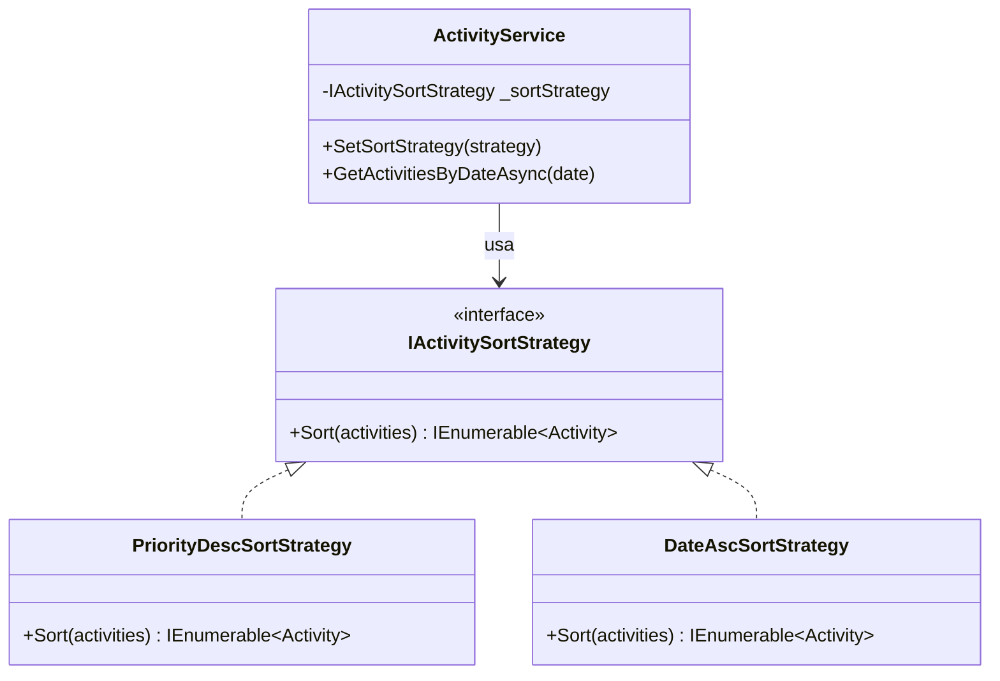
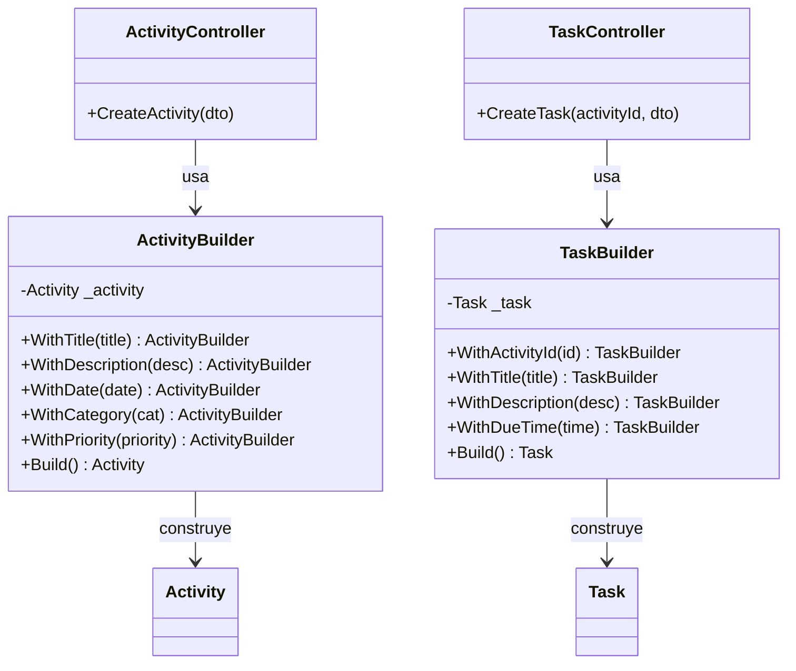

# Patrones de Diseño GoF — TaskFlow API

| Patrón | Categoría | Archivos |
|--------|-----------|----------|
| Strategy | Comportamiento | `TaskFlow.Application/Strategies/` |
| Builder  | Creación       | `TaskFlow.Domain/Builders/`        |

---

## Patrón 1: Strategy

**Problema que resuelve:** El ordenamiento de actividades estaba hardcodeado dentro de `ActivityService`. Si se quería otro criterio de orden había que modificar el servicio directamente, violando el principio Open/Closed.

**Solución:** Se extrae el algoritmo de ordenamiento a una interfaz `IActivitySortStrategy`. Cada implementación concreta encapsula un criterio distinto. El servicio solo conoce la interfaz.

### Estructura

```
IActivitySortStrategy          ← Contrato (interfaz)
  ├── PriorityDescSortStrategy ← Ordena High > Normal > Low
  └── DateAscSortStrategy      ← Ordena cronológicamente

ActivityService
  └── usa IActivitySortStrategy (por defecto: PriorityDesc)
      └── SetSortStrategy() permite cambiarla en runtime
```

### Diagrama



### Antes vs Después

**Antes** (hardcodeado en el servicio):
```csharp
return activities.OrderByDescending(a => a.Priority == "High" ? 0 : a.Priority == "Normal" ? 1 : 2);
```

**Después** (Strategy):
```csharp
// En ActivityService
return _sortStrategy.Sort(activities);

// Para cambiar el criterio desde fuera:
service.SetSortStrategy(new DateAscSortStrategy());
```

---

## Patrón 2: Builder

**Problema que resuelve:** Los controladores construían entidades (`Activity`, `Task`) asignando propiedades una a una directamente. Esto es propenso a errores (olvidar campos, valores nulos) y hace el código difícil de leer.

**Solución:** Se crean `ActivityBuilder` y `TaskBuilder` que encadenan la construcción paso a paso y aplican valores por defecto automáticamente (`CreatedAt`).

### Estructura

```
ActivityBuilder
  .WithTitle()
  .WithDescription()
  .WithDate()
  .WithCategory()
  .WithPriority()
  .Build() → Activity

TaskBuilder
  .WithActivityId()
  .WithTitle()
  .WithDescription()
  .WithDueTime()
  .Build() → Task
```

### Diagrama



### Antes vs Después

**Antes** (manual en el controlador):
```csharp
var activity = new Activity
{
    Title = dto.Title,
    Description = dto.Description,
    Date = dto.Date,
    Category = dto.Category,
    Priority = dto.Priority ?? "Normal"
};
```

**Después** (Builder):
```csharp
var activity = new ActivityBuilder()
    .WithTitle(dto.Title)
    .WithDescription(dto.Description)
    .WithDate(dto.Date)
    .WithCategory(dto.Category)
    .WithPriority(dto.Priority ?? "Normal")
    .Build();
```
