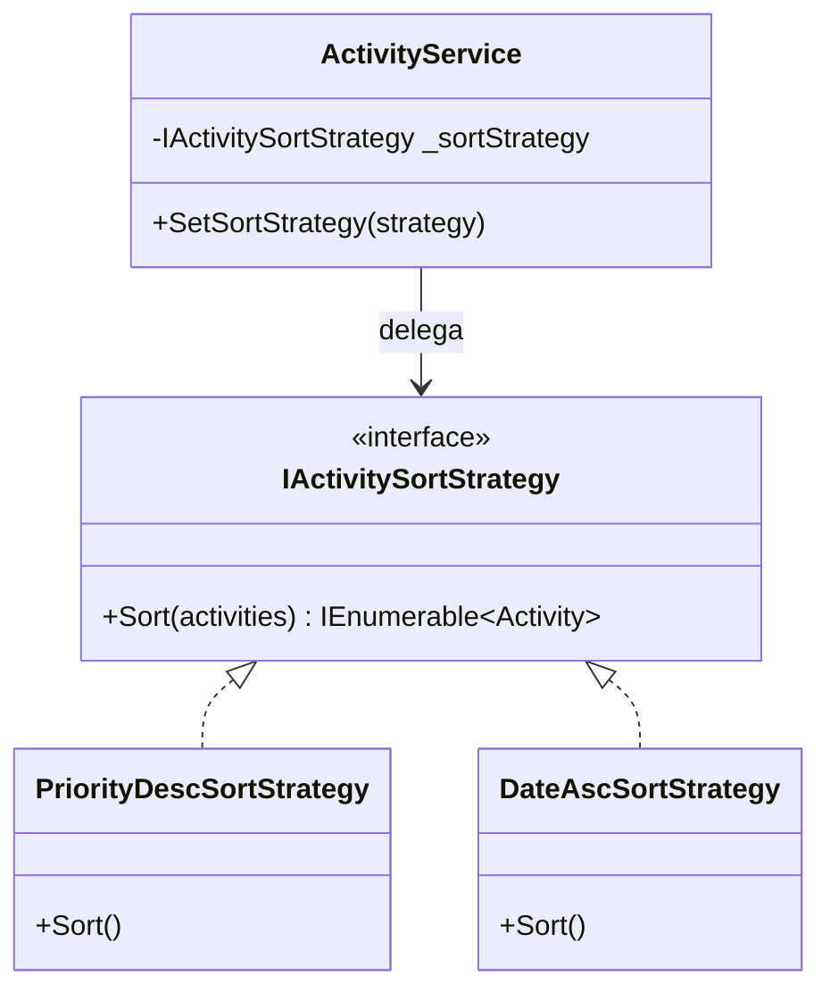
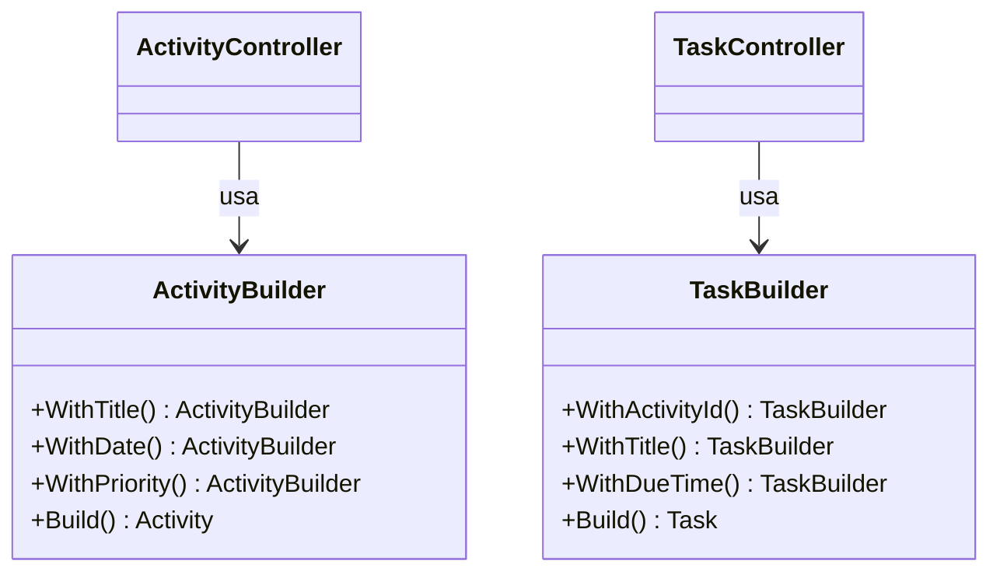
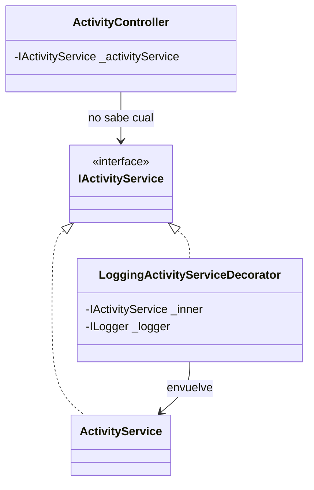
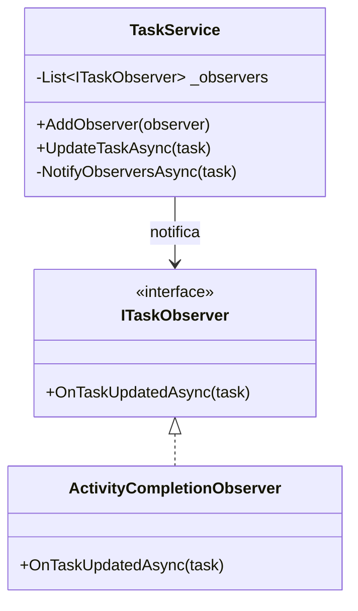
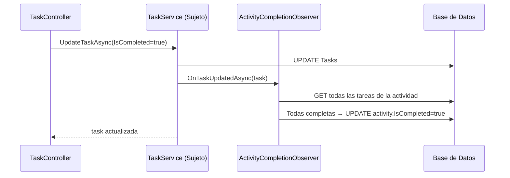

# Patrones de Diseño GoF — TaskFlow API

| # | Patrón | Categoría | Archivos principales |
|---|--------|-----------|----------------------|
| 1 | Strategy  | Comportamiento | `TaskFlow.Application/Strategies/` |
| 2 | Builder   | Creación       | `TaskFlow.Domain/Builders/` |
| 3 | Decorator | Estructural    | `TaskFlow.Application/Decorators/` |
| 4 | Observer  | Comportamiento | `TaskFlow.Application/Observers/` |

---

## Patrón 1: Strategy

**Problema:** El ordenamiento de actividades estaba hardcodeado en `ActivityService`.

**Solución:** Se extrae el algoritmo a `IActivitySortStrategy`. El servicio delega el ordenamiento a la estrategia activa, que puede cambiarse en runtime.



**Antes:** `activities.OrderByDescending(a => a.Priority == "High" ? 0 : 1)`

**Después:** `_sortStrategy.Sort(activities)` — intercambiable sin tocar el servicio.

---

## Patrón 2: Builder

**Problema:** Los controladores construían entidades manualmente propiedad a propiedad.

**Solución:** `ActivityBuilder` y `TaskBuilder` encadenan la construcción y asignan `CreatedAt` automáticamente.



**Antes:** `var activity = new Activity { Title = dto.Title, ... };`

**Después:** `new ActivityBuilder().WithTitle(dto.Title).WithPriority("High").Build();`

---

## Patrón 3: Decorator

**Problema:** Se necesitaba logging en `ActivityService` sin modificar su código ni violar responsabilidad única.

**Solución:** `LoggingActivityServiceDecorator` implementa `IActivityService` y envuelve al servicio real. Los controladores reciben exactamente el mismo contrato — no saben que hay un decorator.



**Registro en Program.cs:**
```csharp
var realService = new ActivityService(repo);
return new LoggingActivityServiceDecorator(realService, logger);
```

**Output en consola:**
```
[INFO] [ActivityService] CreateActivity: "Estudiar Arquitectura"
[INFO] [ActivityService] Created with Id: 7
```

---

## Patrón 4: Observer

**Problema:** Al completar una tarea no había forma de reaccionar al evento. Agregar esa lógica en `TaskService` acoplaría responsabilidades.

**Solución:** `TaskService` actúa como **Sujeto** y notifica observadores tras cada `UpdateTaskAsync`. `ActivityCompletionObserver` revisa si todas las tareas de la actividad están completas y auto-marca la actividad (o la reabre si se des-completa).



**Flujo:**


**Registro en Program.cs:**
```csharp
var service = new TaskService(repo);
service.AddObserver(sp.GetRequiredService<ActivityCompletionObserver>());
return service;
```
