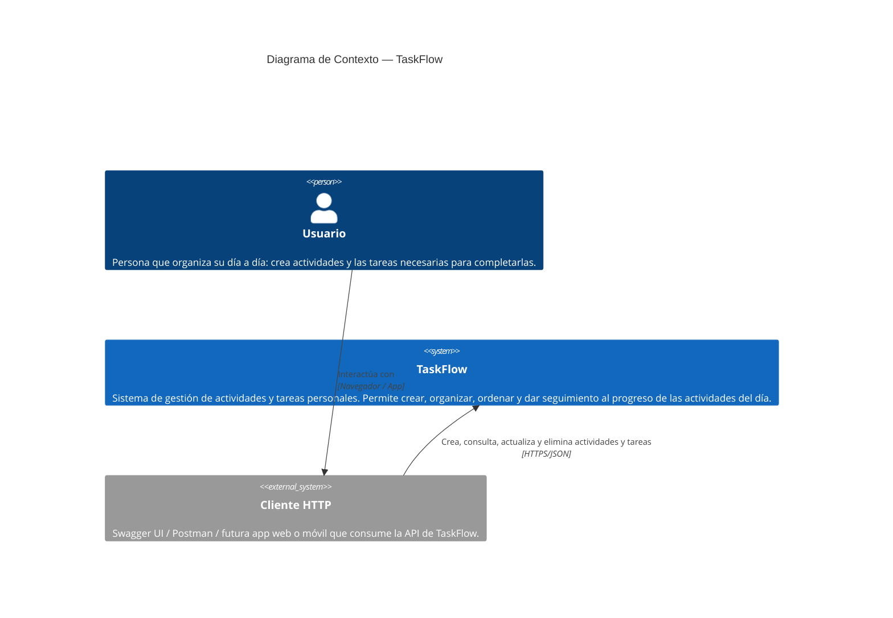

# Modelo C4 — TaskFlow

Documentación de la arquitectura de **TaskFlow** (API RESTful de gestión de actividades
y tareas personales, ASP.NET Core 8 + arquitectura en capas + patrones GoF) usando el
modelo C4, versionada como código (Mermaid) dentro del repositorio.

---

## Nivel 1 — Contexto

**Para quién es:** stakeholders no técnicos (profesor, cliente, nuevo integrante del equipo).
**Pregunta que responde:** ¿qué es el sistema y quién lo usa? Sin entrar en tecnología ni
en piezas internas.

### Notas del Nivel 1

- El **usuario** nunca habla directamente con el sistema por fuera de un cliente HTTP:
  hoy ese cliente es Swagger UI (incluido en el propio API), pero el diseño no acopla
  el sistema a ningún cliente específico — cualquier app web o móvil podría consumirlo.
- TaskFlow **no depende de sistemas externos** de terceros (no hay integración con
  correo, pagos, calendario externo, etc. en el estado actual del proyecto).
- La base de datos **no aparece en este nivel** a propósito: en Contexto solo interesa
  el sistema como una caja única frente al usuario; el detalle de sus piezas internas
  (incluida la base de datos) se muestra en el Nivel 2.
