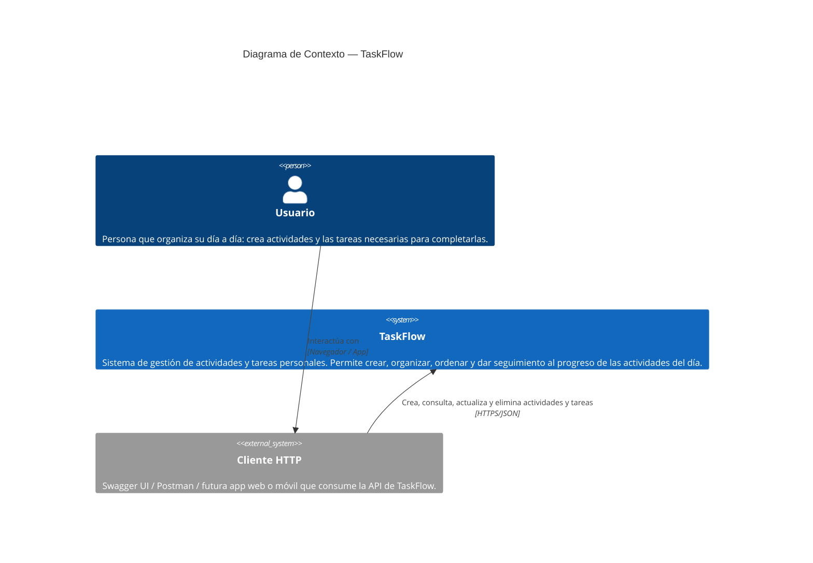
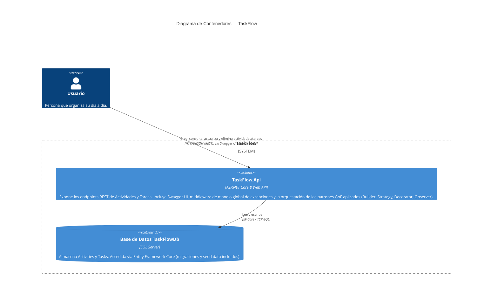
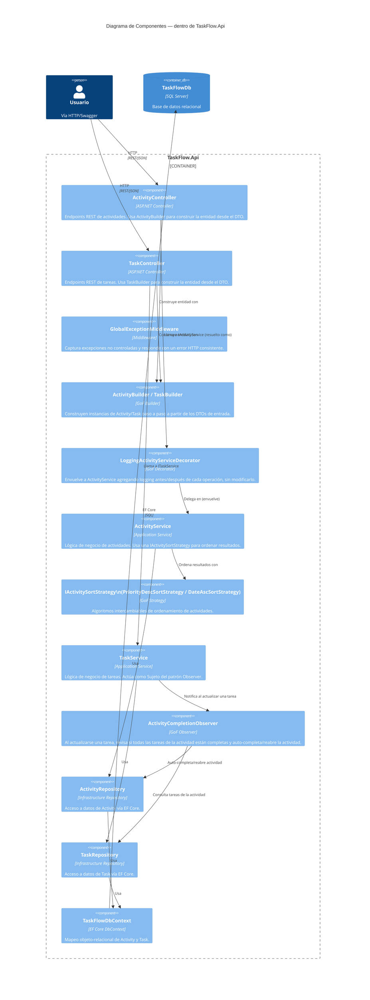

# Modelo C4 — TaskFlow

Documentación de la arquitectura de **TaskFlow** (API RESTful de gestión de actividades
y tareas personales, ASP.NET Core 8 + arquitectura en capas + patrones GoF) usando el
modelo C4, versionada como código (Mermaid) dentro del repositorio.

---

## Nivel 1 — Contexto

**Para quién es:** stakeholders no técnicos (profesor, cliente, nuevo integrante del equipo).
**Pregunta que responde:** ¿qué es el sistema y quién lo usa? Sin entrar en tecnología ni
en piezas internas.

### Notas del Nivel 1

- El **usuario** nunca habla directamente con el sistema por fuera de un cliente HTTP:
  hoy ese cliente es Swagger UI (incluido en el propio API), pero el diseño no acopla
  el sistema a ningún cliente específico — cualquier app web o móvil podría consumirlo.
- TaskFlow **no depende de sistemas externos** de terceros (no hay integración con
  correo, pagos, calendario externo, etc. en el estado actual del proyecto).
- La base de datos **no aparece en este nivel** a propósito: en Contexto solo interesa
  el sistema como una caja única frente al usuario; el detalle de sus piezas internas
  (incluida la base de datos) se muestra en el Nivel 2.

---

## Nivel 2 — Contenedores

**Para quién es:** el equipo técnico y quien vaya a desplegar o integrar el sistema.
**Pregunta que responde:** ¿cuáles son las piezas grandes que se ejecutan por separado
(aplicaciones, bases de datos) y cómo se comunican entre sí?

### Notas del Nivel 2

- Aunque internamente `TaskFlow.Api` se compone de varias capas (`Application`, `Domain`,
  `Infrastructure`), técnicamente es **un solo contenedor**: se compila y despliega como
  un único proceso ASP.NET Core. Esas capas son componentes internos, no contenedores
  independientes — se detallan en el Nivel 3.
- El único contenedor con estado persistente es la base de datos `TaskFlowDb` (SQL Server),
  gestionada con migraciones de EF Core (`TaskFlow.Infrastructure/Migrations`).
- No existe todavía un contenedor de frontend (SPA/móvil) en el repositorio; el consumo
  se hace hoy vía Swagger UI, servido dentro del mismo contenedor del API.

---

## Nivel 3 — Componentes

**Para quién es:** desarrolladores que van a trabajar dentro del contenedor `TaskFlow.Api`.
**Pregunta que responde:** ¿qué piezas hay dentro del contenedor principal, cómo se
comunican, y qué patrones GoF ya están implementados?

### Notas del Nivel 3

- Los **4 patrones GoF** implementados en el proyecto (documentados también en
  `PATRONES-GOF.md` y `ADR-03`) quedan explícitos como componentes:
  - **Builder** (`ActivityBuilder`, `TaskBuilder`) — construcción de entidades desde DTOs.
  - **Strategy** (`IActivitySortStrategy`) — algoritmo de orden intercambiable en tiempo de ejecución.
  - **Decorator** (`LoggingActivityServiceDecorator`) — logging transversal sin tocar `ActivityService`.
  - **Observer** (`ActivityCompletionObserver`) — auto-completado de actividades reaccionando a cambios en sus tareas.
- `GlobalExceptionMiddleware` es transversal a todos los controllers (no se dibujó cada
  relación individual para no saturar el diagrama).
- Las flechas de `Controller → Service` respetan la inyección de dependencias real
  configurada en `Program.cs`: `ActivityController` recibe `IActivityService`, cuya
  implementación registrada en el contenedor DI es el `Decorator`, que a su vez envuelve
  al `ActivityService` real.
