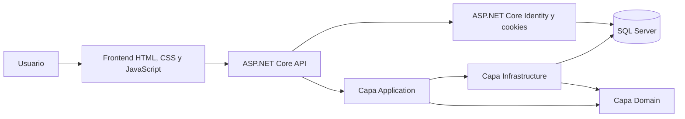
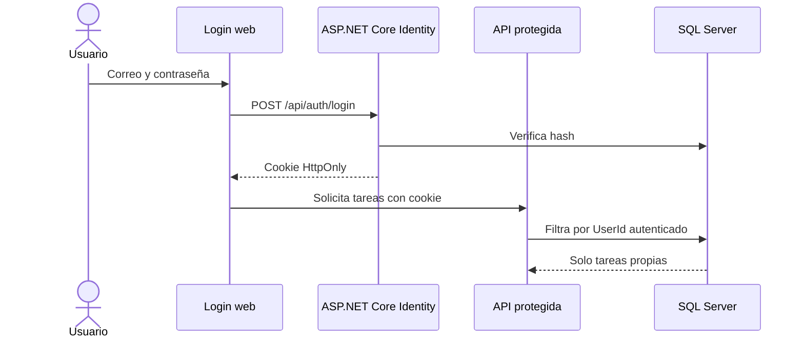
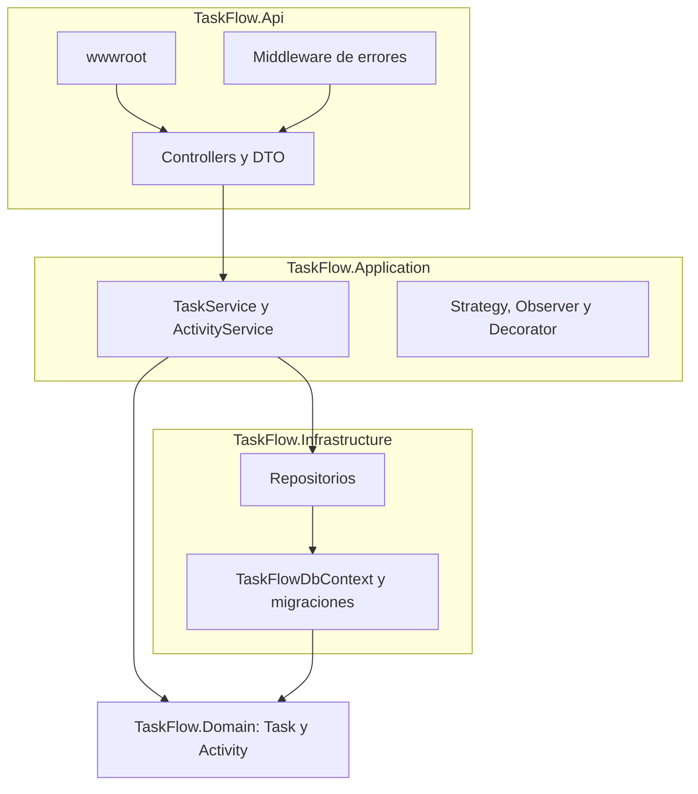
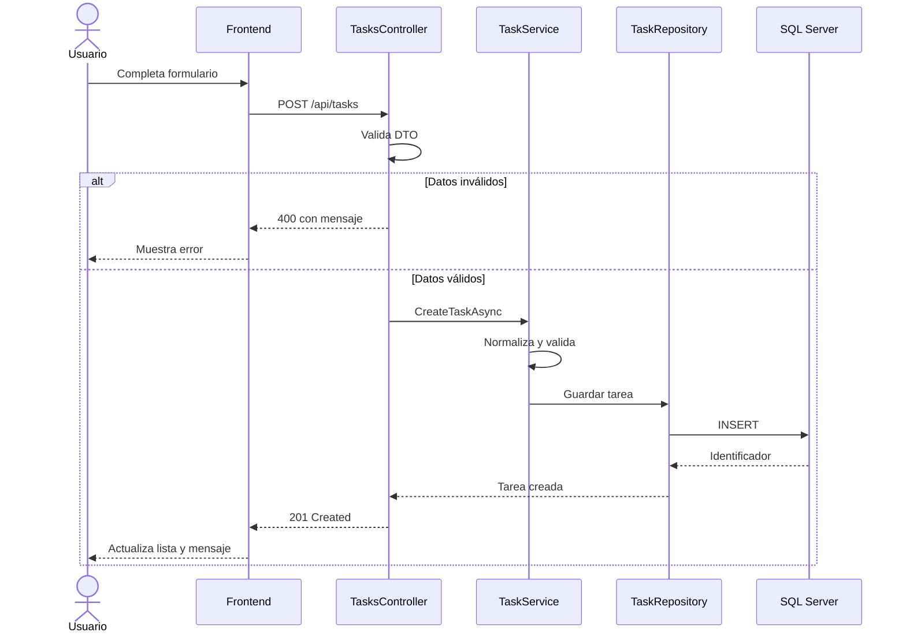
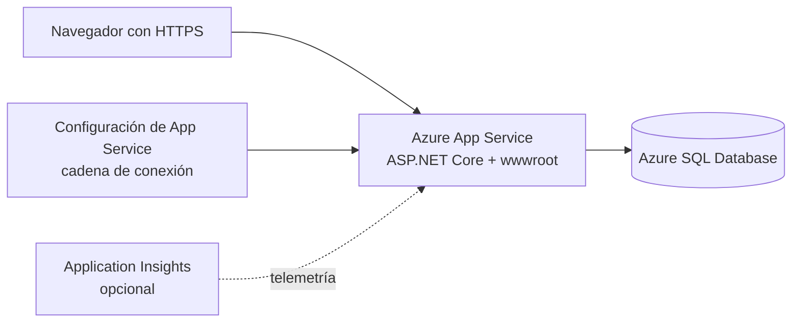
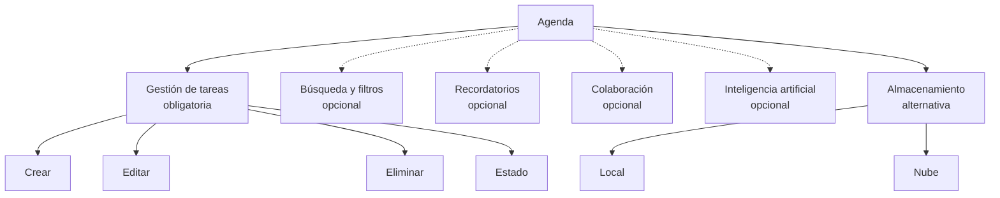

# Diagramas de TaskFlow

## Arquitectura

```mermaid
flowchart LR
    U["Usuario"] --> W["Frontend HTML, CSS y JavaScript"]
    W --> API["ASP.NET Core API"]
    API --> ID["ASP.NET Core Identity y cookies"]
    API --> APP["Capa Application"]
    APP --> INF["Capa Infrastructure"]
    INF --> DB[("SQL Server")]
    ID --> DB
    APP --> DOM["Capa Domain"]
    INF --> DOM
```

## Autenticación y propiedad

```mermaid
sequenceDiagram
    actor Usuario
    participant Web as Login web
    participant Identity as ASP.NET Core Identity
    participant API as API protegida
    participant DB as SQL Server
    Usuario->>Web: Correo y contraseña
    Web->>Identity: POST /api/auth/login
    Identity->>DB: Verifica hash
    Identity-->>Web: Cookie HttpOnly
    Web->>API: Solicita tareas con cookie
    API->>DB: Filtra por UserId autenticado
    DB-->>API: Solo tareas propias
```

## Componentes

```mermaid
flowchart TB
    subgraph Api["TaskFlow.Api"]
        Static["wwwroot"]
        Controllers["Controllers y DTO"]
        Middleware["Middleware de errores"]
    end
    subgraph Application["TaskFlow.Application"]
        Services["TaskService y ActivityService"]
        Patterns["Strategy, Observer y Decorator"]
    end
    subgraph Infrastructure["TaskFlow.Infrastructure"]
        Repositories["Repositorios"]
        EF["TaskFlowDbContext y migraciones"]
    end
    Domain["TaskFlow.Domain: Task y Activity"]
    Static --> Controllers
    Controllers --> Services
    Middleware --> Controllers
    Services --> Repositories
    Services --> Domain
    Repositories --> EF
    EF --> Domain
```

## Flujo para crear una tarea

```mermaid
sequenceDiagram
    actor Usuario
    participant Web as Frontend
    participant API as TasksController
    participant Service as TaskService
    participant Repo as TaskRepository
    participant DB as SQL Server
    Usuario->>Web: Completa formulario
    Web->>API: POST /api/tasks
    API->>API: Valida DTO
    alt Datos inválidos
        API-->>Web: 400 con mensaje
        Web-->>Usuario: Muestra error
    else Datos válidos
        API->>Service: CreateTaskAsync
        Service->>Service: Normaliza y valida
        Service->>Repo: Guardar tarea
        Repo->>DB: INSERT
        DB-->>Repo: Identificador
        Repo-->>API: Tarea creada
        API-->>Web: 201 Created
        Web-->>Usuario: Actualiza lista y mensaje
    end
```

## Despliegue en Azure

```mermaid
flowchart LR
    Browser["Navegador con HTTPS"] --> App["Azure App Service\nASP.NET Core + wwwroot"]
    App --> Sql[("Azure SQL Database")]
    Config["Configuración de App Service\ncadena de conexión"] --> App
    Monitor["Application Insights\nopcional"] -. telemetría .-> App
```

## Modelo de características

```mermaid
flowchart TB
    Agenda["Agenda"]
    Agenda --> Gestion["Gestión de tareas\nobligatoria"]
    Gestion --> Crear["Crear"]
    Gestion --> Editar["Editar"]
    Gestion --> Eliminar["Eliminar"]
    Gestion --> Estado["Estado"]
    Agenda -.-> Filtros["Búsqueda y filtros\nopcional"]
    Agenda -.-> Recordatorios["Recordatorios\nopcional"]
    Agenda -.-> Colaboracion["Colaboración\nopcional"]
    Agenda -.-> IA["Inteligencia artificial\nopcional"]
    Agenda --> Storage["Almacenamiento\nalternativa"]
    Storage --> Local["Local"]
    Storage --> Cloud["Nube"]
```
